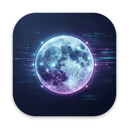

  

<h1 align="center">Moontors</h1>

  <strong>Run Claude Code, Codex and Gemini CLI side by side, on macOS, Windows and Linux.</strong> 
  A free agentic development environment (ADE) that keeps every agent in view, and working in the background.

  
  
  

  <a href="https://github.com/moontors/moontors/releases/latest"><strong>Download</strong></a> ·
  <a href="https://github.com/moontors/moontors/issues/new/choose">Report a bug</a> ·
  <a href="https://github.com/moontors/moontors/issues/new/choose">Request a feature</a>

---

Moontors is an **ADE, an agentic development environment**: a desktop app for macOS, Windows and
Linux where you direct AI coding agents instead of typing every line yourself. It runs
**Claude Code**, **Codex** and **Gemini CLI** side by side. Every session sits on one board,
streaming its work live, so you can follow them all, answer the one that needs you, and review what
each one changed without leaving the app. A background service runs the agents, so they keep
working when the window is closed.

> **Early preview.** Moontors is at 0.x. It's ready for daily use, but expect rough edges, and
> please [tell us](https://github.com/moontors/moontors/issues/new/choose) when you find one.

## Features

- **Every agent on one board.** Claude Code, Codex and Gemini CLI sessions side by side, each card
  showing its transcript live. Sort them into your own sections, and filter by project.
- **Keeps working without you.** Sessions run in a background service, not in the window, so they
  carry on when you close it. While Moontors is open, a desktop notification tells you when a
  session needs you or runs into trouble.
- **You decide what agents may do.** Permission modes from Manual to Bypass, changed as you go,
  with Allow and Deny right in the transcript.
- **A branch per task.** A session can work in its own git worktree and branch, with the files it
  needs copied in, and archiving it asks before anything is removed.
- **Review as you go.** A diff of the session's changes, and a file editor beside the agent that
  never overwrites the agent's work, or yours.
- **The agents' own commands.** Each agent's slash commands work in Moontors, apart from those
  that only make sense in a terminal, along with `/rewind`, `/compact`, side questions, subtasks,
  forks, `/export` and `@` file mentions.
- **Your setup, untouched.** Your agents' settings, MCP servers, skills, commands and plugins all
  reach Moontors' sessions, and Moontors never writes your own configuration files.
- **Usage at a glance.** A context meter on every card, token usage, and your account's limits.
- **Private by design.** No Moontors account, no telemetry, no tracking. Moontors keeps your
  sessions on your computer, and each agent talks to its own vendor, to the services and MCP servers you
  set it up with, and to any site its own tools reach, just as it would in your terminal.

## Download

Get the newest version from the **[latest release](https://github.com/moontors/moontors/releases/latest)**.

| Platform | Download                                                                 | Requires                    |
| -------- | ------------------------------------------------------------------------ | --------------------------- |
| macOS    | the `.dmg` ending in `-arm64` for Apple silicon, the other one for Intel | macOS 13 Ventura or later   |
| Windows  | `Moontors-Setup-<version>.exe`                                           | Windows 10 or later, x64    |
| Linux    | `Moontors-x86_64.AppImage`, or the `.deb` for Ubuntu and Debian          | x86-64 Linux with a desktop |

Moontors downloads and verifies each agent's own program the first time you use it. You'll also
want [git](https://git-scm.com): Moontors uses it for worktree sessions and diffs, and on Windows
Claude Code needs [Git for Windows](https://gitforwindows.org).

### First launch

- **macOS:** open the `.dmg` and drag Moontors to Applications. Until Moontors' macOS builds are
  signed, macOS says it can't check the app the first time you open it: open **System Settings ›
  Privacy & Security**, and choose **Open Anyway** for Moontors.
- **Windows:** run the installer. Until Moontors' Windows builds are signed, SmartScreen may warn
  about an unrecognized app: choose **More info**, then **Run anyway**. Windows 11's Smart App
  Control, when it's on, blocks unsigned apps outright.
- **Linux:** make the AppImage executable (`chmod +x Moontors-x86_64.AppImage`) and run it, or
  install the `.deb` with `sudo apt install ./<file>.deb`.
  - The AppImage needs FUSE. Without it, start it with `--appimage-extract-and-run`.
  - On systems that restrict unprivileged user namespaces, such as Ubuntu 24.04, the AppImage
    runs with Chromium's sandbox off, while the `.deb` keeps it on.

## Getting started

1. **Sign in to a provider:** with your Claude or ChatGPT account in the browser, or with an API
   key, which Moontors keeps in your system's keychain. Gemini CLI takes a Gemini API key, as
   Google doesn't let personal accounts sign in to it through the browser.
2. **Create a session:** pick a project folder, choose an agent and a model, and give it a task.
3. **Follow along on the board.** Open any session to read its full transcript, answer its
   questions, or review its changes.

## Updates

Moontors checks for a new version when it starts and every 4 hours, and downloads it in the
background. When it's ready, Moontors offers **Restart to update**. Choose it when it suits you:
Moontors waits for running work to finish, installs the update and reopens.

- The AppImage updates itself. The `.deb` asks for your password to update.
- Until Moontors' macOS builds are signed, macOS offers **Download** instead, which opens the new
  version's download page.

## Questions

**What is an agentic development environment (ADE)?**
It's where you work with AI coding agents rather than only an editor. You start agents on tasks,
follow their progress, answer their questions and permission requests, and review their changes.
Moontors does that for several agents at once, from different vendors, in one window.

**Does Moontors replace Claude Code, Codex or Gemini CLI?**
No. Moontors runs each vendor's own official agent, so you get the same agent, signed in with your
own account and using your own settings, MCP servers and skills, with a desktop app around it.

**What do I need to use it?**
An account with the agent's vendor: a Claude subscription or an Anthropic API key for Claude Code,
a ChatGPT plan or an OpenAI API key for Codex, and a Gemini API key for Gemini CLI. Moontors itself
is free.

**Can several agents work on the same repository?**
Yes. Each session can work in its own git worktree and branch, so agents don't step on each other's
changes, and you review and merge each branch as you would anyone's.

**Does Moontors see my code?**
No. There are no Moontors servers. Each agent talks to its own vendor, to the services and MCP
servers you set it up with, and to any site its own tools reach, as it would in your terminal, and
Moontors keeps your sessions on your computer.

## Feedback and support

- **Found a bug?** [Open an issue](https://github.com/moontors/moontors/issues/new/choose) and
  include the build line from Moontors' **About** window or `/status`. It names your exact version.
- **Have an idea?** [Request a feature](https://github.com/moontors/moontors/issues/new/choose).
- **Anything else:** [hello@moontors.com](mailto:hello@moontors.com).

## Privacy and terms

Moontors has no account, telemetry or tracking. The [Privacy Policy](PRIVACY.md) says exactly what
it keeps, where, and what reaches the internet. Use of Moontors is governed by the
[Terms of Use](TERMS.md).

---

© 2026 Moontors. All rights reserved. Moontors is an independent agentic development
environment, not affiliated with or endorsed by Anthropic, OpenAI or Google. Claude Code, Codex and
Gemini CLI are trademarks of their respective owners.
